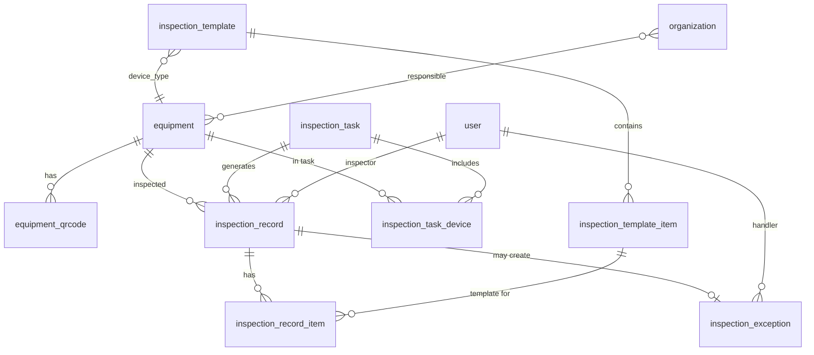

# Schema 与前端字段对比分析

> 对比 `schema-inspector.mysql.sql` 与 pc-admin 前端数据结构，输出需删除、需新增的表与字段。

---

## 1. 现有 Schema 与前端映射

### 1.1 用户与认证

| Schema 表 | 前端实体 | 映射说明 |
|-----------|----------|----------|
| `user` | auth store (`name`, `role`) | `user.name` → 用户姓名；`role.name` 通过 `user_role` 关联 |
| `user` | 登录 | `username`, `password` 用于登录 |
| `role` | auth store | `role.name` 展示为「运维平台主管」等 |
| `user_role` | - | 用户与角色多对多 |

**user 表字段与前端：**

| Schema 字段 | 前端使用 | 说明 |
|-------------|----------|------|
| `id` | ✓ | 主键 |
| `name` | ✓ | 用户姓名 |
| `username` | ✓ | 登录账号 |
| `password` | ✓ | 登录密码 |
| `mobile` | ✓ | 可作手机号（org 中 phone） |
| `enabled` | ✓ | 对应 status 启用/停用 |
| `email`, `phone`, `avatar`, `gender`, `remark` | 可选 | 扩展信息 |
| `admin`, `photograph_key`, `last_login_*`, `extension`, `id_card` | 未用 | 可保留 |

### 1.2 组织与人员

| Schema 表 | 前端实体 | 映射说明 |
|-----------|----------|----------|
| `organization` | orgRows (`dept`) | 部门/车间/班组，`organization.name` → `dept` |
| `position` | orgRows (`post`) | 岗位，`position.name` → `post` |
| `user_organization` | orgRows | 关联 user、organization、position |

**orgRows 前端字段：**

| 前端字段 | Schema 来源 |
|----------|-------------|
| `key` | `user.id` |
| `username` | `user.mobile` 或 `user.username` |
| `deptId` | `organization.id` |
| `dept` | `organization.name` |
| `postId` | `position.id` |
| `post` | `position.name` |
| `name` | `user.name` |
| `phone` | `user.mobile` |
| `area` | **缺失**，需在 organization 或 user_organization 增加 |
| `status` | `user.enabled` |

### 1.3 菜单与权限

| Schema 表 | 前端 | 说明 |
|-----------|------|------|
| `menu` | AdminLayout 侧边栏 | `path`, `name`, `icon` 等 |
| `role_menu` | 权限控制 | 按角色过滤菜单 |

---

## 2. 需删除的字段

以下字段在 Schema 中已标注废弃或前端未使用，建议删除或标记废弃：

| 表 | 字段 | 说明 |
|----|------|------|
| `role` | `product_id` | 注释已标明「产品主键(废弃)」 |

**可选删除（若确认无业务使用）：**

| 表 | 字段 | 说明 |
|----|------|------|
| `menu` | `terminal_id` | 访问端主键，多端场景可保留 |
| `menu` | `application_id` | 应用主键 |
| `menu` | `category_id` | 分类字典主键 |
| `user_organization` | `appointment_id` | 职位主键，与 position_id 可能重复 |

> 建议：仅删除 `role.product_id`，其余字段暂保留，待业务确认后再处理。

---

## 3. 需新增的表

Schema 中**缺少**整套巡检业务表，需新增以下表：

| 序号 | 表名 | 说明 | 对应前端 |
|------|------|------|----------|
| 1 | `equipment` | 设备台账 | EquipmentView, equipmentRows |
| 2 | `inspection_template` | 巡检模板 | TemplateView, templateRows |
| 3 | `inspection_template_item` | 巡检项 | template.items |
| 4 | `inspection_task` | 计划任务 | TaskView, taskRows |
| 5 | `inspection_task_device` | 任务-设备关联 | task.deviceKeys |
| 6 | `inspection_record` | 巡检记录 | RecordView, recordRows |
| 7 | `inspection_record_item` | 巡检记录明细 | 逐项填写结果 |
| 8 | `inspection_exception` | 异常记录 | ExceptionView, exceptionRows |
| 9 | `equipment_qrcode` | 设备二维码 | qrcodeRows |

---

## 4. 需新增的字段

### 4.1 现有表新增字段

| 表 | 字段 | 类型 | 说明 |
|----|------|------|------|
| `organization` | `area` | VARCHAR(100) | 责任区域（如 A 区、B 区、全厂），前端 orgRows.area 使用 |

> 若 `organization` 的 `extension` 已存 JSON，可将 `area` 放入 extension，避免改表。建议单独字段便于查询。

---

## 5. 表结构设计草案

### 5.1 equipment（设备台账）

| 字段 | 类型 | 必填 | 说明 | 前端对应 |
|------|------|------|------|----------|
| `id` | BIGINT(20) | ✓ | 主键 | key |
| `code` | VARCHAR(64) | ✓ | 设备编码，唯一 | code |
| `type` | VARCHAR(32) | ✓ | 设备类型 | type |
| `name` | VARCHAR(100) | ✓ | 设备名称 | name |
| `model` | VARCHAR(64) | | 型号 | model |
| `voltage` | VARCHAR(32) | | 电压等级 | voltage |
| `location` | VARCHAR(200) | | 安装地点 | location |
| `organization_id` | BIGINT(20) | | 责任部门/班组 | team |
| `commission_date` | DATE | | 投运日期 | date |
| `status` | VARCHAR(20) | ✓ | 运行中/检修中/停用 | status |
| `deleted` | BIGINT(20) | ✓ | 软删除 | - |
| `create_time` | DATETIME | | | - |
| `update_time` | DATETIME | | | - |

### 5.2 inspection_template（巡检模板）

| 字段 | 类型 | 必填 | 说明 | 前端对应 |
|------|------|------|------|----------|
| `id` | BIGINT(20) | ✓ | 主键 | key |
| `name` | VARCHAR(100) | ✓ | 模板名称 | name |
| `device_type` | VARCHAR(32) | ✓ | 设备类型，与 equipment.type 一致 | deviceType |
| `description` | TEXT | | 模板说明 | description |
| `version` | VARCHAR(32) | | 版本号 | version |
| `status` | VARCHAR(20) | | 启用中/草稿 | status |
| `deleted` | BIGINT(20) | ✓ | 软删除 | - |
| `create_time` | DATETIME | | | - |
| `update_time` | DATETIME | | | - |

### 5.3 inspection_template_item（巡检项）

| 字段 | 类型 | 必填 | 说明 | 前端对应 |
|------|------|------|------|----------|
| `id` | BIGINT(20) | ✓ | 主键 | key |
| `template_id` | BIGINT(20) | ✓ | 模板主键 | - |
| `name` | VARCHAR(100) | ✓ | 巡检项名称 | name |
| `type` | VARCHAR(20) | ✓ | 录入方式，当前仅 radio | type |
| `required` | TINYINT(1) | ✓ | 是否必填 | required |
| `rule` | VARCHAR(500) | | 判定规则/异常标准 | rule |
| `default_value` | VARCHAR(64) | | 默认值（正常/异常） | defaultValue |
| `options` | VARCHAR(500) | | 选项 JSON，如 ["正常","异常"] | options |
| `sort` | INT | | 排序 | - |
| `deleted` | BIGINT(20) | ✓ | 软删除 | - |

### 5.4 inspection_task（计划任务）

| 字段 | 类型 | 必填 | 说明 | 前端对应 |
|------|------|------|------|----------|
| `id` | BIGINT(20) | ✓ | 主键 | key |
| `plan` | VARCHAR(200) | ✓ | 任务名称 | plan |
| `cycle` | VARCHAR(20) | ✓ | daily/weekly/monthly/quarterly/yearly/once | cycle |
| `time` | VARCHAR(10) | | 执行时间 HH:mm | time |
| `cycle_extra` | VARCHAR(200) | | 周期扩展 JSON，如 {weekday,day,month} | cycleExtra |
| `execute_at` | DATETIME | | 临时任务执行时间 | executeAt |
| `cron` | VARCHAR(64) | | Cron 表达式 | cron |
| `team` | VARCHAR(64) | | 责任班组 | team |
| `owner` | VARCHAR(64) | | 负责人 | owner |
| `status` | VARCHAR(20) | ✓ | 待执行/执行中/已完成/已逾期/已关闭 | status |
| `deleted` | BIGINT(20) | ✓ | 软删除 | - |
| `create_time` | DATETIME | | | - |
| `update_time` | DATETIME | | | - |

### 5.5 inspection_task_device（任务-设备关联）

| 字段 | 类型 | 必填 | 说明 | 前端对应 |
|------|------|------|------|----------|
| `id` | BIGINT(20) | ✓ | 主键 | - |
| `task_id` | BIGINT(20) | ✓ | 任务主键 | - |
| `equipment_id` | BIGINT(20) | ✓ | 设备主键 | deviceKeys[] |

### 5.6 inspection_record（巡检记录）

| 字段 | 类型 | 必填 | 说明 | 前端对应 |
|------|------|------|------|----------|
| `id` | BIGINT(20) | ✓ | 主键 | key |
| `task_id` | BIGINT(20) | | 关联任务 | - |
| `equipment_id` | BIGINT(20) | ✓ | 设备主键 | device |
| `inspector_id` | BIGINT(20) | | 巡检人 user.id | inspector |
| `scan_time` | DATETIME | | 扫码时间 | scanTime |
| `submit_time` | DATETIME | | 提交时间 | submitTime |
| `result` | VARCHAR(20) | | 正常/异常 | result |
| `photo_count` | INT | | 照片数量 | photos |
| `deleted` | BIGINT(20) | ✓ | 软删除 | - |
| `create_time` | DATETIME | | | - |

### 5.7 inspection_record_item（巡检记录明细）

| 字段 | 类型 | 必填 | 说明 | 前端对应 |
|------|------|------|------|----------|
| `id` | BIGINT(20) | ✓ | 主键 | - |
| `record_id` | BIGINT(20) | ✓ | 巡检记录主键 | - |
| `template_item_id` | BIGINT(20) | ✓ | 巡检项主键 | - |
| `value` | VARCHAR(200) | | 填写值（正常/异常等） | - |
| `remark` | VARCHAR(500) | | 备注 | - |
| `photos` | TEXT | | 照片 URL 或 ID 列表 JSON | - |

### 5.8 inspection_exception（异常记录）

| 字段 | 类型 | 必填 | 说明 | 前端对应 |
|------|------|------|------|----------|
| `id` | BIGINT(20) | ✓ | 主键 | key |
| `code` | VARCHAR(64) | ✓ | 异常编号，唯一 | code |
| `equipment_id` | BIGINT(20) | ✓ | 设备主键 | device |
| `record_id` | BIGINT(20) | | 来源巡检记录 | - |
| `level` | VARCHAR(20) | | 异常等级（高/中/低） | - |
| `desc` | TEXT | | 异常描述 | desc |
| `handler_id` | BIGINT(20) | | 处理人 user.id | handler |
| `deadline` | DATETIME | | 截止时间 | deadline |
| `status` | VARCHAR(20) | ✓ | 待处理/处理中/已处理 | status |
| `deleted` | BIGINT(20) | ✓ | 软删除 | - |
| `create_time` | DATETIME | | | - |
| `update_time` | DATETIME | | | - |

### 5.9 equipment_qrcode（设备二维码）

| 字段 | 类型 | 必填 | 说明 | 前端对应 |
|------|------|------|------|----------|
| `id` | BIGINT(20) | ✓ | 主键 | key |
| `equipment_id` | BIGINT(20) | ✓ | 设备主键 | device |
| `batch` | VARCHAR(32) | | 批次 | batch |
| `version` | VARCHAR(32) | | 版本 | version |
| `status` | VARCHAR(20) | | 生效中/已重生成/失效 | status |
| `content` | TEXT | | 二维码内容或存储路径 | - |
| `deleted` | BIGINT(20) | ✓ | 软删除 | - |
| `create_time` | DATETIME | | | - |

---

## 6. 实体关系示意

---

## 7. 汇总

| 操作类型 | 数量 | 明细 |
|----------|------|------|
| **需删除字段** | 1 | role.product_id |
| **需新增字段** | 1 | organization.area |
| **需新增表** | 9 | equipment, inspection_template, inspection_template_item, inspection_task, inspection_task_device, inspection_record, inspection_record_item, inspection_exception, equipment_qrcode |

---

*文档生成日期：基于 schema-inspector.mysql.sql 与 pc-admin 前端 mock/视图结构对比*
